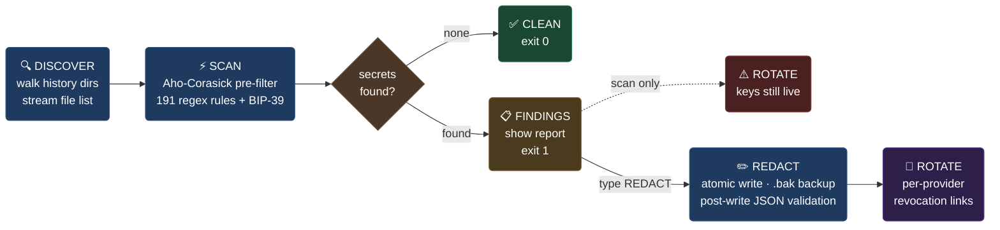

<div align="center">


# AgentSweep

**Find and redact secrets in your AI coding agent's local history. Fully offline.**

[](https://pypi.org/project/agentsweep/)
[](https://pypi.org/project/agentsweep/)
[](https://github.com/Ishannaik/agent-sweep/actions/workflows/ci.yml)
[](LICENSE)
[](https://www.python.org/downloads/)
[](#)
[](https://github.com/Ishannaik/agent-sweep/stargazers)
[](https://github.com/Ishannaik/agent-sweep)

> **Prevention:** Don't paste API keys into cloud-backed AI agents at all — the key transits the provider's servers before it ever hits your disk.
>
> **If you already did:** agentsweep removes the remaining local attack vector — supply-chain malware and compromised packages that scan your disk for credentials. Your files never leave your machine.

---

**30 agents supported:** Claude Code · Codex · OpenCode · Cursor · Windsurf · Aider · Cline · Kilo Code · Roo Code · PearAI · Trae · Void · Gemini CLI · Qwen Code · Continue · Open Interpreter · GitHub Copilot Chat · OpenClaw · Hermes · Goose · llm (Datasette) · Warp · Grok CLI · Kiro CLI · Zed · Codebuff · Plandex · Junie · Mentat · JetBrains AI

> **Experimental sources** (Warp, Grok CLI, Kiro CLI, Zed, Codebuff, Plandex, Qwen Code, PearAI, Trae, Void, Junie, Mentat, JetBrains AI) have storage paths/formats derived from research but **not yet verified against a real install**. Scanning is safe — a wrong path simply finds nothing — but they may under-report until confirmed. They're tagged `(experimental)` in the picker and print a notice on scan.

**191 detection rules** — AWS, GitHub, Stripe, OpenAI, Anthropic, Google, Slack, Discord, HuggingFace, JWT, PEM keys, DB URLs, BIP-39 seed phrases, and [many more](#whats-detected)

**Alpha** — every destructive step is gated, backed up, and reversible with one command

</div>

## The problem

Claude Code (and every other AI coding CLI) stores your full conversation history as plain-text JSONL on disk — under `~/.claude/projects/` for Claude Code, `~/.codex/sessions/` for OpenAI Codex. Anything you paste — an AWS key, a `.env` file, a database URL — sits in clear text indefinitely. A typical dev's history accumulates dozens of secrets over months, often without them realizing.

`agentsweep` scans that history, tells you what leaked, and can redact the secret values in place while preserving the JSONL structure byte-for-byte. It also tells you which keys to rotate, with the right revocation URL for each provider.

> **Scope of protection:** agentsweep itself is fully local and offline — it reads and writes only files on your machine and makes zero network calls. It removes one attack vector: secrets sitting in local history files. It does not affect what your AI provider already received: when you paste a key into Claude Code, Cursor, or any cloud-backed agent, that key already transited the provider's servers before it hit disk. If that concerns you, consider a locally-hosted model (Ollama, LM Studio, OpenCode) where nothing leaves your machine at all — agentsweep pairs especially well with local-model setups.

## Why this matters right now

Supply chain attacks are accelerating. In 2024–2025 a wave of malicious npm and PyPI packages — `sha256-universal`, `shailulid`, hundreds of typosquats — were caught doing one thing: **exfiltrating developer credentials off the machine that installed them**. They target environment variables, `.env` files, shell history, SSH keys, and now AI agent history files.

AI coding assistants have created a new category of credential exposure that didn't exist two years ago:

- You paste a production API key into Claude Code to debug something → it's now in `~/.claude/projects/*/conversations/*.jsonl` forever
- A compromised npm package runs `postinstall` → scans common paths → finds your JSONL history → exfiltrates 50 API keys in one request
- You rotate the key you used in public but forget the dozen others in your history
- Meanwhile your history grows: every `.env` you asked an AI to help with, every DB URL you shared for debugging, every token you pasted for a one-liner

**AI agent history is the new `.bash_history` — except it contains full context, not just commands.** The attack tooling already knows this. `agentsweep` exists to clean up before it's exploited.

## Quick start

```bash
pip install uv                  # get uv (skip if you already have it)
uv tool install agentsweep      # install — adds `agentsweep` and `asweep` to PATH
asweep                          # run — interactive menu guides you through everything
```

That's it. No virtualenv to activate, no PATH fiddling — `uv tool install` gives the command its own isolated environment.

## How it works

agentsweep runs a fixed 5-stage pipeline. `scan` stops after stage 3; `fix` continues through redaction.



Every write is protected by 8 safety invariants — atomic replace, mandatory `.bak` backup, symlink rejection, mtime/process gates, and post-write JSONL validation. `agentsweep undo` restores from backups.

## Install

**Recommended — isolated, no venv conflicts:**
```bash
uv tool install agentsweep      # one-time install
uv tool upgrade agentsweep      # update to latest
```

**Try without installing (always runs latest):**
```bash
uvx agentsweep@latest
```

**Classic pip:**
```bash
pip install agentsweep
pip install --upgrade agentsweep
```

> Don't have `uv`? `pip install uv` or see [astral.sh/uv](https://docs.astral.sh/uv/). Requires Python 3.11+.

## Usage

### Interactive mode

Run with no arguments in a terminal and you get the full experience — banner,
numbered menu, typed confirmations before anything destructive, and one-key
undo (restores the `.bak` backups). Any interactive scan that finds secrets
ends with an offer to redact them on the spot (type `REDACT` to confirm):

```
agentsweep
```

Scripting is unaffected: any flag, or a piped/redirected stream, skips the
menu entirely and behaves exactly as documented below.

### Verbs

| Command | What it does |
|---|---|
| `agentsweep scan` | Scan only — read-only, no files are modified (default when no verb given) |
| `agentsweep fix` | Scan, then offer to redact findings in place (type `REDACT` to confirm) |
| `agentsweep undo` | Restore all `.bak` backups, reverting any previous redaction |
| `agentsweep purge` | Delete all `.bak` backups once the leaked keys are rotated (permanent — `undo` stops working) |
| `agentsweep list-sources` | List every supported agent and show which ones have history on this machine (read-only) |
| `agentsweep --version` / `-V` | Print the installed version |
| `agentsweep --update` | Check PyPI for a newer release |

The legacy flag form `agentsweep --fix` is still accepted and behaves identically to `agentsweep fix`.

### Source selection

Pick which agent's history to target with `--source`. The default is `claude-code`.

```bash
agentsweep scan --source claude-code          # ~/.claude/projects/ (default)
agentsweep scan --source codex                # ~/.codex/sessions/
agentsweep scan --source opencode             # OpenCode SQLite store
agentsweep scan --source cursor               # Cursor history
agentsweep scan --source windsurf             # Windsurf history
agentsweep scan --source aider                # per-repo .aider.chat.history.md under $HOME
agentsweep scan --source cline                # Cline history
agentsweep scan --source gemini-cli           # Gemini CLI history
agentsweep scan --source continue-vscode      # Continue (VS Code) history
agentsweep scan --source github-copilot-chat  # GitHub Copilot Chat history
agentsweep scan --source openclaw             # OpenClaw ~/.openclaw/
agentsweep scan --source hermes               # Hermes Agent ~/.hermes/state.db
agentsweep scan --source goose                # Goose ~/.local/share/goose/
agentsweep scan --source llm                   # Datasette llm CLI logs.db (io.datasette.llm/)
```

Not sure which agents you have installed? `list-sources` prints every supported
source, its history location, and whether that history exists on this machine —
so you know which `--source` values are worth scanning. It reads nothing and
writes nothing.

```bash
agentsweep list-sources             # all 29 sources + which are on disk
agentsweep list-sources --detected  # only the ones found on this machine
agentsweep list-sources --json      # machine-readable (for scripts/CI)
```

Scan **every** registered agent in one pass (aggregated findings; redaction stays per-source):

```bash
agentsweep scan --all                 # all registered sources
agentsweep scan --all --detected      # only sources with a history root on disk
agentsweep scan --all --json          # aggregated JSON (each finding has "source")
agentsweep scan --all --json -o out.json
```

Override the default root directory to scan any arbitrary folder:

```bash
agentsweep scan --root ~/backups/claude-history
agentsweep fix  --root /tmp/history-copy --allow-production
```

### Scan / fix flags

```bash
# Machine-readable JSON to stdout (exit 0 = clean, 1 = findings found, 2 = error)
agentsweep scan --json

# Write findings JSON to a file instead of stdout
agentsweep scan --json -o findings.json
agentsweep scan --json --output /tmp/report.json

# Skip .agentsweepignore files
agentsweep scan --no-ignore
```

### Fix-only flags

```bash
# Redact Claude Code history in place (--allow-production required for default roots during alpha)
agentsweep fix --allow-production

# Skip creating .bak backups (not recommended)
agentsweep fix --allow-production --no-backup

# Bypass soft safety checks: mtime gate (files modified <60 s ago) and running-process gate
agentsweep fix --allow-production --force

# Combine: non-interactive JSON-mode redaction against a custom root
agentsweep fix --root ~/history-copy --json
```

### Undo flags

```bash
# Undo redactions for a specific source
agentsweep undo --source codex

# Undo against a custom root
agentsweep undo --root ~/history-copy
```

## Corruption-prevention guarantees

A redactor that corrupts your history is strictly worse than the leak it's fixing. agentsweep enforces these invariants on every `--fix`:

1. **Redaction happens in parsed JSON, not on raw bytes.** Secrets are replaced as string *values* inside the parsed structure, then re-serialized. Structural damage is impossible by construction.
2. **Atomic writes.** Every rewrite goes: temp file → `fsync()` → `os.replace()` over the original. A crash at any instant leaves either the complete old file or the complete new file — never a torn write.
3. **Post-write validation.** Before committing, the new content must pass a format-aware check: JSONL — every non-empty line parses as JSON and the line count matches the original; whole-file JSON — the document parses; markdown/plaintext — the line count matches the original; SQLite — the rewritten copy passes `PRAGMA integrity_check`. If the check fails, the write aborts and the original is untouched.
4. **`.bak` backup by default.** Created owner-readable only (mode `0600`) since it holds the pre-redaction secrets; refuses to run if a `.bak` already exists (so prior backups can't be clobbered).
5. **Path containment.** Refuses any target that doesn't resolve inside one of the source's history trees (e.g. Windsurf's User dir and its `~/.codeium/windsurf/memories/`).
6. **Symlink rejection.** Refuses symlinks outright.
7. **mtime window.** Refuses files modified in the last 60 seconds (likely an active session). `--force` overrides.
8. **Running-process check.** Refuses if a Claude Code process appears to be running. `--force` overrides.
9. **Alpha-stage production gate.** `--fix` against the default `~/.claude/projects/` root requires `--allow-production` until v1.0.
10. **Audit log.** Every write appends SHA256 before/after and path to `~/.agentsweep/audit.jsonl`.

## Recovery

Every redacted file has a sibling `*.bak` with the original bytes. The easiest way to undo all redactions for a source is:

```bash
agentsweep undo                        # undo Claude Code (default)
agentsweep undo --source codex         # undo a specific source
agentsweep undo --root ~/history-copy  # undo against a custom root
```

If you need to restore a single file manually (e.g. you deleted the undo command's source):

```bash
mv session.jsonl.bak session.jsonl
```

The backups hold the **pre-redaction originals — plaintext secrets**, so a sweep isn't finished until the leaked keys are rotated and the backups are gone. Once you've rotated:

```bash
agentsweep purge                       # delete Claude Code backups (asks first)
agentsweep purge --source windsurf     # delete a specific source's backups
agentsweep purge --yes                 # non-interactive (scripts / CI)
```

## What's detected

191 high-confidence patterns **plus a checksum-validated crypto seed-phrase detector** — BIP-39 mnemonics (12/15/18/21/24 words; the wallet format behind BTC, ETH, SOL, BNB, ADA, DOGE, LTC, DOT, AVAX and virtually every major chain) and Electrum seeds are confirmed cryptographically (BIP-39 checksum / Electrum version tag), so English prose that happens to use wallet words never false-positives.

The patterns: AWS access keys, GitHub tokens (PAT/OAuth/App/fine-grained), Stripe live/test, OpenAI, Anthropic, Google API, Slack bot/user/webhook, Hugging Face, JWT, PEM private keys, DB URLs with embedded passwords, npm/PyPI/SendGrid/Twilio tokens — plus 167 rules ported from the [gitleaks](https://github.com/gitleaks/gitleaks) pack covering GitLab, Grafana, HashiCorp Vault/Terraform, DigitalOcean, Shopify, PlanetScale, Databricks, Atlassian, Azure AD, 1Password, Sentry, New Relic, Mailgun, Datadog, Twilio, Twitter/X, Twitch, Yandex, JFrog, Snyk, Mailchimp, curl credentials on the command line, and many more. Patterns are high-precision — false positives are rare, and provider-context rules are keyword-gated so large pastes stay fast.

## What's NOT detected

- Custom/proprietary secrets without a recognizable prefix.
- Monero seed phrases (25 words from Monero's own wordlist — planned).
- Unknown tokens that look like arbitrary base64.
- Secrets split across multiple messages.
- Anything inside a binary/non-UTF-8 file.

For deeper detection, run `gitleaks` or `trufflehog` alongside agentsweep — their rule packs are more exhaustive. agentsweep's value is the **agent-history-specific surface**, not the detection engine.

## FAQ

**Why does `uvx agentsweep` show an old version?**
uvx caches tools locally. Use `uvx agentsweep@latest` to always run the newest version (recommended), or force a cache refresh with `uvx --reinstall agentsweep`.

**Where is OpenCode in the menu?**
OpenCode support was added in v0.1.1. Run `pip install --upgrade agentsweep` or `uvx agentsweep@latest` to get it.

**Does agentsweep send my data anywhere?**
No. It is fully offline — zero network calls during scanning or redacting. The only optional network call is the background update check, which only fetches the latest version number from PyPI.

## Contributors

Thanks to everyone who has contributed code, bug reports, and ideas.

[](https://github.com/Ishannaik/agent-sweep/graphs/contributors)

## Star Gazers

[](https://github.com/Ishannaik/agent-sweep/stargazers)

## License

MIT. See LICENSE.
